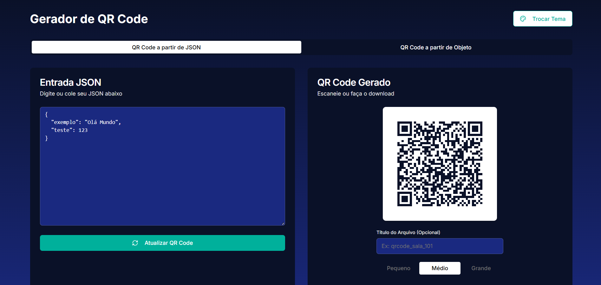
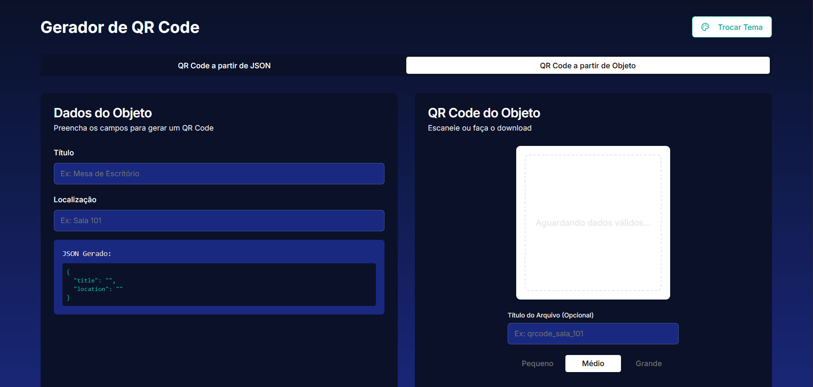

# 🎨 Gerador de QR Code

Este é um aplicativo web moderno e responsivo para gerar QR Codes de forma rápida e fácil.  
Ele permite que os usuários criem QR Codes a partir de texto simples, links ou dados estruturados em formato JSON, com opções de personalização de tamanho e tema.

<div style="display: flex;">


</div>


---

## ✨ Funcionalidades Principais

- **Múltiplos Tipos de Entrada**: Gere QR Codes a partir de dados em formato JSON ou preenchendo um formulário simples com campos como "Título" e "Localização".  
- **Validação em Tempo Real**: O editor de JSON valida a sintaxe enquanto você digita, informando se o formato está correto.  
- **Customização de Tamanho**: Escolha entre três tamanhos predefinidos (Pequeno, Médio, Grande) para o seu QR Code.  
- **Download em PNG**: Baixe o QR Code gerado como um arquivo PNG com um clique.  
- **Nome de Arquivo Personalizado**: Defina um título para o seu QR Code, que será usado como nome do arquivo ao fazer o download.  
- **Temas Dinâmicos**: O aplicativo oferece múltiplos temas (claro, escuro e um tema bônus) e respeita a preferência de tema do seu sistema operacional. A sua escolha de tema é salva para visitas futuras.  
- **Notificações**: Receba feedback visual ao realizar ações como o download de um QR Code.  

---

## 🚀 Tecnologias Utilizadas

- **Next.js** – Framework React para renderização do lado do servidor e geração de sites estáticos.  
- **React** – Biblioteca para construir interfaces de usuário.  
- **TypeScript** – Superset de JavaScript que adiciona tipagem estática.  
- **Tailwind CSS** – Framework CSS utility-first para estilização rápida e responsiva.  
- **shadcn/ui & Radix UI** – Coleção de componentes de UI reutilizáveis e acessíveis.  
- **Zod** – Biblioteca de validação de esquemas para TypeScript.  
- **React Hook Form** – Gerenciamento de formulários performático e flexível.  
- **qrcode.react** – Componente React para renderizar QR Codes.  
- **Context API & Cookies** – Para gerenciamento de tema de forma persistente.  

---

## 📂 Estrutura do Projeto

```
/
├── app/
│   ├── globals.css         # Estilos globais
│   ├── layout.tsx          # Layout principal da aplicação
│   └── page.tsx            # Página inicial e principal componente
├── components/
│   └── ui/                 # Componentes de UI (shadcn)
├── context/
│   └── themecontext.tsx    # Provedor de contexto para o tema
├── hooks/
│   └── use-toast.ts        # Hook para notificações
├── lib/
│   └── utils.ts            # Funções utilitárias (ex: cn)
├── styles/
│   └── themes.ts           # Definições dos temas de cores
├── next.config.mjs         # Configurações do Next.js
├── package.json            # Dependências e scripts
└── tsconfig.json           # Configurações do TypeScript
```

---

## 🛠️ Instalação e Execução

1. **Clone o repositório**
   ```bash
   git clone https://github.com/seu-usuario/Gerador-de-QR-Code.git
   ```

2. **Acesse o diretório do projeto**
   ```bash
   cd Gerador-de-QR-Code
   ```

3. **Instale as dependências**
   ```bash
   npm install
   # ou
   yarn install
   ```

4. **Inicie o servidor de desenvolvimento**
   ```bash
   npm run dev
   # ou
   yarn dev
   ```

5. **Abra o navegador**
   - Acesse **http://localhost:3000** para ver a aplicação em execução.

---

## 📬 Contato

👤 **Desenvolvedor:** Guilherme Silva Rios  
🌐 [Portfólio](https://guilhermeriosdev.vercel.app)  
💻 [GitHub](https://github.com/guilhermeprog3)  
